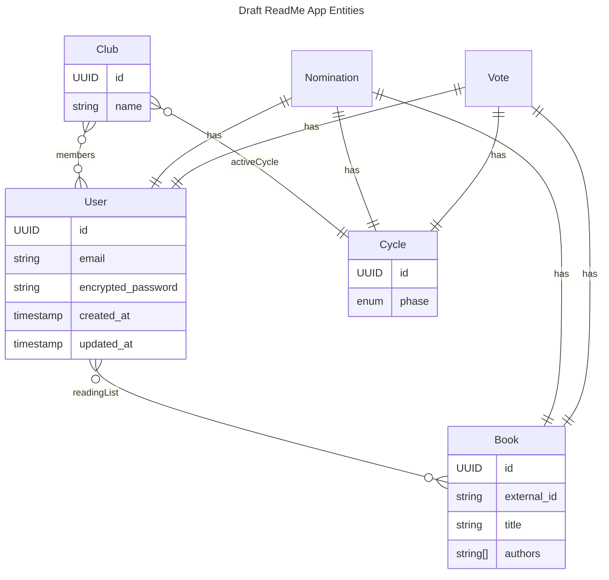

```mermaid
---
title: Draft ReadMe App Entities
---
erDiagram
  User }o--o{ Book : readingList
  Club }o--o{ User : members
  Club }o--|| Cycle : activeCycle
  Nomination ||--|| Book : has
  Nomination ||--|| Cycle : has
  Nomination ||--|| User : has
  Vote ||--|| Book : has
  Vote ||--|| Cycle : has
  Vote ||--|| User : has

  User {
    UUID id
    string email
    string encrypted_password
    timestamp created_at
    timestamp updated_at
  }

  Book {
    UUID id
    string external_id
    string title
    string[] authors
  }

  Club {
    UUID id
    string name
  }

  Cycle {
    UUID id
    enum phase
  }
```
